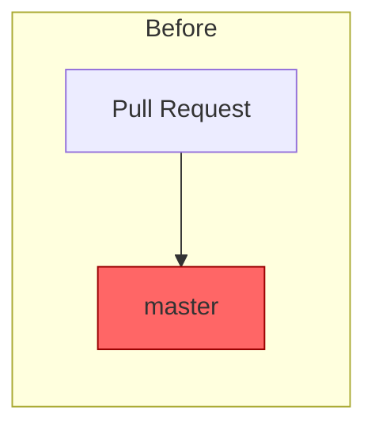
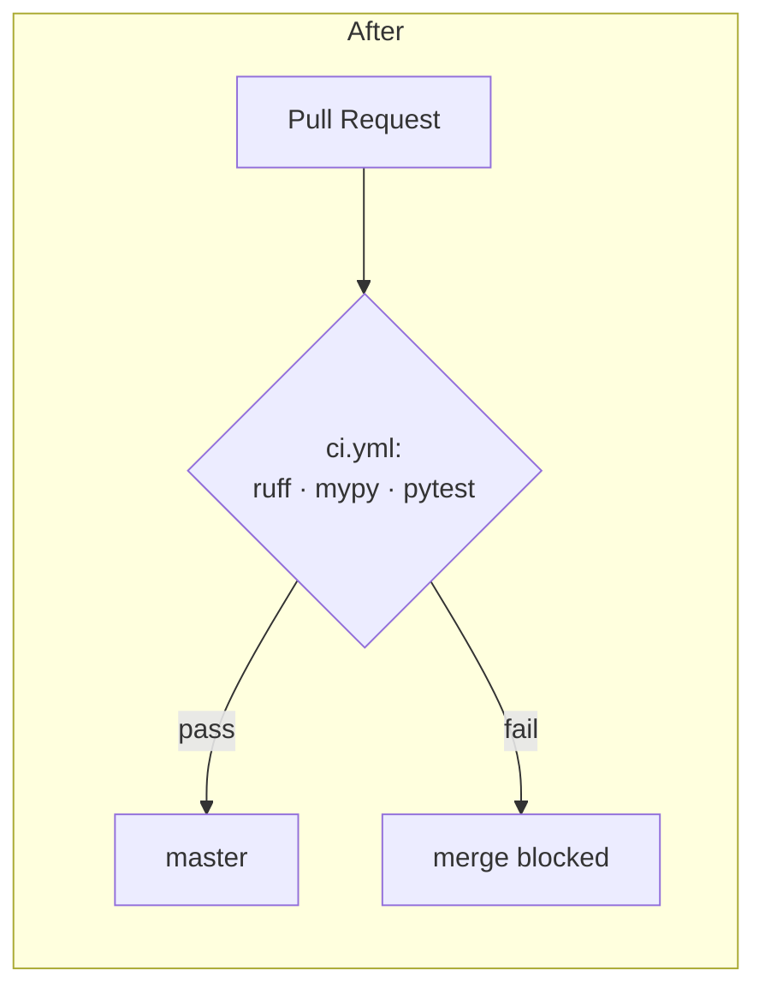

# 🏗️ Architect: Add a CI workflow that runs lint, typecheck, and tests on every PR

**Status:** proposed
**Risk:** low
**Approver:** repo maintainer (@cleanunicorn)

## Why now

While scanning the repo for structural debt, I found that `master` has been
unable to import its own proxy module since April 2026
(commit `806f376`, ~3.5 months). `src/drove/proxy.py` and
`src/drove/server_manager.py` both contain Python 2-style
`except A, B:` clauses (`proxy.py:337,464,480`, `server_manager.py:136`),
which are a hard `SyntaxError` under Python 3:

```
$ python3 -c "import ast; ast.parse(open('src/drove/proxy.py').read())"
SyntaxError: multiple exception types must be parenthesized
```

Because `drove.proxy` is the FastAPI app and `drove.server_manager` is the
backend-lifecycle manager, this means `drove serve` — the tool's core
command — cannot currently be imported on Python 3. `uv run pytest` fails to
*collect* all 10 test files as a result.

This was never caught because `.github/workflows/` has no job that runs the
project's own `make lint` / `make typecheck` / `make test` targets. The
existing workflows (`claude.yml`, `install.yml`, `release.yml`,
`pr-title.yml`) don't execute the test suite. Every PR — including ones
touching `proxy.py` and `server_manager.py` directly — has merged without
that safety net.

This is a pure gap-in-the-pipeline problem, not a one-off code mistake: the
same class of regression can land again the moment CI isn't there to catch
it. That's the structural issue this proposal addresses.

> Note: the underlying `except A, B:` syntax bugs themselves are **not**
> part of this proposal — that's a bug fix, out of scope here. See
> "Migration plan" for how the two work together.

## Before / after


No automated gate runs `pytest` / `ruff` / `mypy` before merge — regressions
(including ones that break `import`) can land silently.



## Proposal

Add one new file, `.github/workflows/ci.yml`, that runs on `pull_request`
and `push` to `master`:

```yaml
name: CI
on:
  pull_request:
  push:
    branches: [master]
jobs:
  ci:
    runs-on: ubuntu-latest
    steps:
      - uses: actions/checkout@v4
      - uses: astral-sh/setup-uv@v3
        with:
          python-version: "3.14"
      - run: uv sync --all-extras
      - run: uv run ruff check .
      - run: uv run mypy src/
      - run: uv run pytest
```

This mirrors the existing `make lint` / `make typecheck` / `make test`
targets exactly — no new tooling, no new conventions.

## Migration plan

1. **Land this workflow file first.** It is purely additive — no existing
   workflow, app code, or `Makefile` target changes. It does not block
   merges by itself (branch protection is a separate, later step — see
   below).
2. **Expect the first run to go red**, because of the pre-existing
   `except A, B:` syntax errors described above. That's a feature, not a
   bug: it's the first real proof the workflow is wired correctly. Land a
   small, separate bug-fix PR (parenthesize the four `except` clauses) to
   turn it green — that fix is intentionally excluded from this proposal
   since it's a bug fix, not an architecture change.
3. **Once green, optionally enable branch protection** (Settings → Branches
   → require the `ci` check before merge). This is a GitHub repo-settings
   change, not a code change, and needs the maintainer to click it — it
   isn't something a PR can carry.

Nothing here is a breaking change to `/v1/*` endpoints, the config schema,
or the CLI surface.

## Performance impact

Negligible and CI-only: `ruff check` + `mypy src/` + `pytest` on this
codebase run in well under a minute on GitHub's standard runners. Zero
runtime/production impact — this workflow never touches the shipped
`drove` binary or its request path.

## Test strategy

The workflow *is* the test. To validate before merging: push a throwaway
commit with a deliberate `ruff` violation to this PR's branch and confirm
the check goes red, then remove it. The first real-world validation is
automatic — on merge, the workflow will immediately flag the pre-existing
`except A, B:` syntax errors described above.

## Timeline

Under an hour: one ~15-line YAML file, no code touched.
