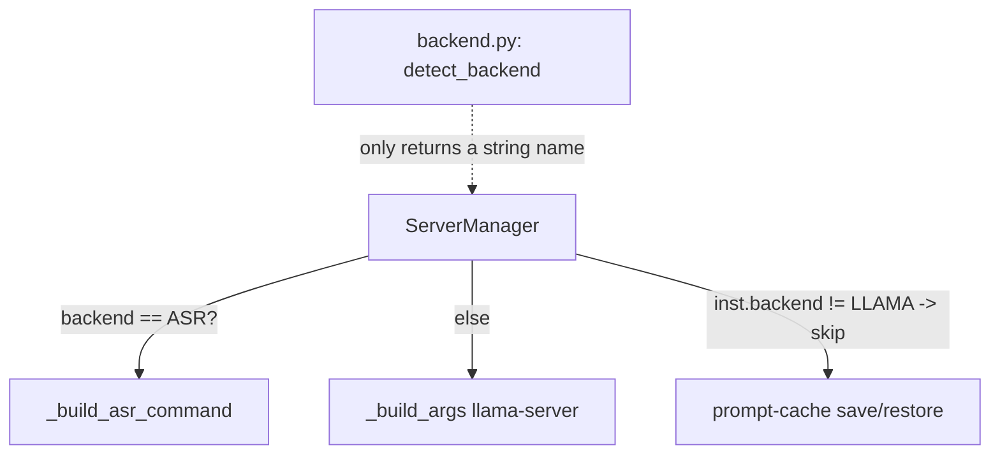
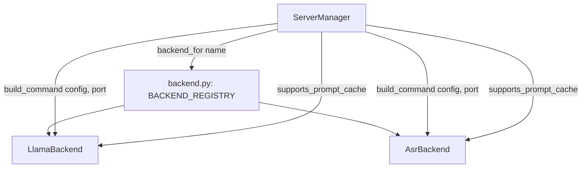

# 🏗️ Architect proposal: extract a `Backend` adapter so `ServerManager` stops branching on backend type

**Status:** proposed, no code changes included
**Author:** Architect (automated structural-debt review)
**Date:** 2026-08-24

## One-sentence proposal

Move the llama-server-vs-ASR command building and prompt-cache-eligibility logic out of
`ServerManager` and into two small `Backend` adapter classes (`LlamaBackend`, `AsrBackend`)
behind a shared interface in `src/drove/backend.py`.

## Why now

`src/drove/backend.py` today only *detects* which backend a model uses
(`detect_backend`). All backend-*specific* behavior — building the subprocess command,
and deciding whether prompt-cache persistence applies — lives inline inside
`ServerManager` (`src/drove/server_manager.py`, 863 lines, the largest module in the
codebase) as `if backend == BACKEND_ASR: ... else: ...` branches:

- `_start()` branches to build either an ASR command or llama-server args (lines 433–449)
- `_save_prompt_cache()` special-cases ASR with `inst.backend != BACKEND_LLAMA` (line 709)
- `_prepare_prompt_cache_dir()` / restore path is implicitly llama-only (`slot_save_path`
  is only ever set in the llama branch)

The last two feature PRs (`feat(server): keep the prompt cache across model sleep`,
`feat(config): expose llama-server cache flags and an extra_args passthrough`) both added
*more* llama-only special-casing to this same class. Each new backend-specific
capability so far has been threaded through `ServerManager` as another branch rather than
through the backend abstraction that already exists for detection. Tests reach into the
manager's private methods to test backend-specific behavior directly
(`manager._build_asr_command(...)`, `manager._infer_asr_model_type(...)` in
`tests/test_server_manager.py`), which is a symptom of the same coupling: there is no
seam to test ASR command-building without going through `ServerManager`.

This is exactly the "missing abstraction" pattern — `detect_backend()` picks a backend
name, but nothing owns what that name *means*. If a third backend is ever added (the
project already positions itself against Ollama/llama.cpp-direct as extensible), every one
of these branch points grows by one more arm.

## Current architecture



`ServerManager` owns process lifecycle, LRU/memory eviction, config-change detection,
*and* both backends' command construction and cache-eligibility rules.

## Proposed architecture



`backend.py` grows a small `Backend` protocol:

```python
class Backend(Protocol):
    name: str
    supports_prompt_cache: bool
    def build_command(self, model_name, model_path, model_cfg, port, **kwargs) -> list[str]: ...
```

`LlamaBackend.build_command` and `AsrBackend.build_command` are the existing
`_build_args`/`_build_asr_command` bodies, moved verbatim. `ServerManager._start` and
`_save_prompt_cache` call `BACKEND_REGISTRY[inst.backend].build_command(...)` /
`.supports_prompt_cache` instead of branching on a string constant.

## Scope

This is the *only* change proposed. It does **not**:
- change `ModelConfig`'s schema or field set
- add a third backend
- touch the `/api/*`-equivalent surface (`/v1/*` OpenAI-compatible endpoints), the CLI, or
  the config file format
- change any runtime behavior — every moved method keeps its current signature-level
  contract; this is a pure move-and-wire-up refactor

## Migration plan (backward-compatible, single stage)

1. Add `Backend` protocol + `LlamaBackend`/`AsrBackend` classes to `backend.py`,
   containing the moved (unmodified) logic from `_build_args` / `_build_asr_command`.
2. Add `BACKEND_REGISTRY: dict[str, Backend]` mapping `BACKEND_LLAMA`/`BACKEND_ASR` to
   instances.
3. Update `ServerManager._start` and `_save_prompt_cache`/cache-prepare paths to go
   through the registry.
4. Delete the now-dead `_build_args`/`_build_asr_command` methods from `ServerManager`.
5. Update the tests that currently call `manager._build_asr_command(...)` /
   `manager._build_args(...)` to instead call `AsrBackend().build_command(...)` /
   `LlamaBackend().build_command(...)` directly — this also removes the private-method
   test coupling noted above.

No dual-write, no feature flag needed: this is an internal refactor with no externally
observable behavior change, so it ships in one PR and is trivially revertible with `git
revert` if anything regresses.

## Performance impact

Negligible. One dict lookup (`BACKEND_REGISTRY[name]`) replaces one `if/else` on a
string — sub-microsecond, and only on the already-slow-path of starting a backend
process (which takes seconds).

## Risk level: **low**

- No API, schema, or CLI contract changes.
- No new runtime dependencies.
- Existing test suite (`tests/test_server_manager.py`) already exercises both backends'
  command-building and can be adapted rather than rewritten.
- Fully reversible in one commit.

## Test strategy

- Move existing `test_build_asr_command`, `test_build_asr_command_requires_onnx_asr`
  assertions to target `AsrBackend.build_command` directly.
- Add an equivalent direct test for `LlamaBackend.build_command` (currently only
  exercised indirectly through `ServerManager._start` integration tests).
- Add one guardrail test asserting `BACKEND_REGISTRY` contains an entry for every value
  in `VALID_BACKENDS`, so a future backend addition that forgets to register fails fast.
- No new integration/e2e tests needed — `_start`'s existing health-check tests cover the
  wiring.

## Who must approve

Single-maintainer repo (`cleanunicorn/drove`) — repo owner sign-off is sufficient. No
infra/security review needed (no data, auth, or network-boundary changes).

## Non-goals / explicitly deferred

- Extracting a third backend adapter type now — no third backend exists yet
  (over-engineering for a hypothetical).
- Renaming `BACKEND_LLAMA`/`BACKEND_ASR` constants or the `backend` config key —
  unrelated to this change, would be a separate proposal.
